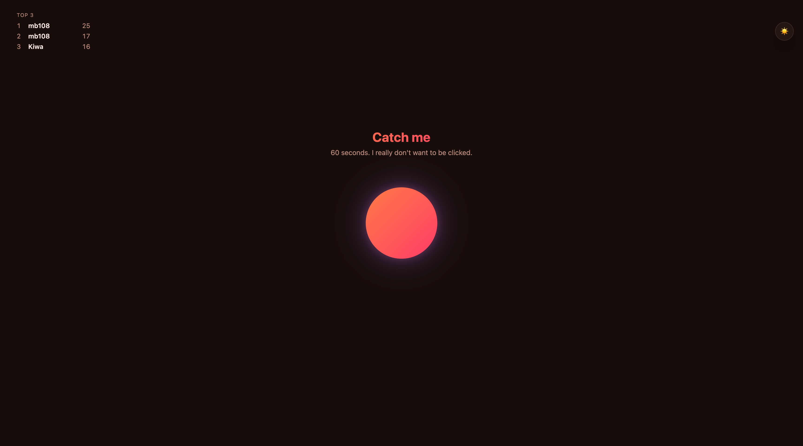

# misbutton

A button that really doesn't want to be clicked. You get 60 seconds to catch it as many times as you can — it notices your cursor coming and dodges away, so cornering it against an edge is a real, learnable strategy, not a gimmick. Top 3 all-time scores go on a global leaderboard.

**Play it: [misbutton.vercel.app](https://misbutton.vercel.app)**




## How it works

The button's dodge is a deterministic, seeded simulation (`shared/evasionEngine.ts`) that runs identically on the client, to render the game in real time, and on the server, to independently replay-verify every submitted score. The client never just reports a click count — it sends the raw cursor/click log, and the server recomputes the score itself by replaying that log through the exact same engine. This is also why the round starts the instant your cursor gets close enough to the resting button, rather than behind a "Play" click: that first reaction is just the engine's normal proximity trigger, not a special case.

## Tech stack

- **[Nuxt 4](https://nuxt.com/)** (Vue 3 + Nitro) — full-stack framework, server API routes and the client app in one codebase
- **TypeScript** throughout, client and server
- Plain CSS (custom properties, no UI framework, no animation library)
- **[Vitest](https://vitest.dev/)** for unit and API-route tests
- Deployed on **[Vercel](https://vercel.com/)**, with **[Upstash Redis](https://upstash.com/)** backing the leaderboard and round anti-cheat storage
- **Vercel Web Analytics** and **Speed Insights**

## Development

```bash
pnpm install
pnpm dev        # http://localhost:3000
pnpm build      # production build
pnpm preview    # preview the production build locally
```

Typecheck:

```bash
pnpm exec nuxi typecheck
```

Test:

```bash
pnpm test
```

## Leaderboard & round storage

Backed by Nitro's `useStorage()` abstraction (see `nuxt.config.ts`) — local dev uses the filesystem driver with no setup required. In production it switches to Upstash Redis automatically once `UPSTASH_REDIS_REST_URL`/`UPSTASH_REDIS_REST_TOKEN` (or Vercel's `KV_REST_API_*` equivalents) are set.

Set `NUXT_ROUND_SECRET` in production if running more than one server instance, so round tokens issued by one instance verify on another.
